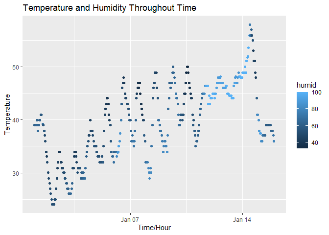

P8105 HW1
================
Sijda Ahmed (sa4007)
2025-09-18

``` r
# load in necessary packages
library(moderndive)
library(tidyverse)
```

    ## ── Attaching core tidyverse packages ──────────────────────── tidyverse 2.0.0 ──
    ## ✔ dplyr     1.1.4     ✔ readr     2.1.5
    ## ✔ forcats   1.0.0     ✔ stringr   1.5.1
    ## ✔ ggplot2   3.5.2     ✔ tibble    3.3.0
    ## ✔ lubridate 1.9.4     ✔ tidyr     1.3.1
    ## ✔ purrr     1.1.0     
    ## ── Conflicts ────────────────────────────────────────── tidyverse_conflicts() ──
    ## ✖ dplyr::filter() masks stats::filter()
    ## ✖ dplyr::lag()    masks stats::lag()
    ## ℹ Use the conflicted package (<http://conflicted.r-lib.org/>) to force all conflicts to become errors

``` r
library(nycflights13)
library(ggplot2)
```

## Problem 1

``` r
# load the early_january_weather dataset
data("early_january_weather")

# check the names of the variables
head(early_january_weather)
```

    ## # A tibble: 6 × 15
    ##   origin  year month   day  hour  temp  dewp humid wind_dir wind_speed wind_gust
    ##   <chr>  <int> <int> <int> <int> <dbl> <dbl> <dbl>    <dbl>      <dbl>     <dbl>
    ## 1 EWR     2013     1     1     1  39.0  26.1  59.4      270      10.4         NA
    ## 2 EWR     2013     1     1     2  39.0  27.0  61.6      250       8.06        NA
    ## 3 EWR     2013     1     1     3  39.0  28.0  64.4      240      11.5         NA
    ## 4 EWR     2013     1     1     4  39.9  28.0  62.2      250      12.7         NA
    ## 5 EWR     2013     1     1     5  39.0  28.0  64.4      260      12.7         NA
    ## 6 EWR     2013     1     1     6  37.9  28.0  67.2      240      11.5         NA
    ## # ℹ 4 more variables: precip <dbl>, pressure <dbl>, visib <dbl>,
    ## #   time_hour <dttm>

``` r
variables = names(early_january_weather)
variables
```

    ##  [1] "origin"     "year"       "month"      "day"        "hour"      
    ##  [6] "temp"       "dewp"       "humid"      "wind_dir"   "wind_speed"
    ## [11] "wind_gust"  "precip"     "pressure"   "visib"      "time_hour"

``` r
# check the size of the dataset
num_row = nrow(early_january_weather)
num_row
```

    ## [1] 358

``` r
num_col = ncol(early_january_weather)
num_col
```

    ## [1] 15

``` r
# find the mean temperature
mean_temp = mean(early_january_weather$temp)
mean_temp
```

    ## [1] 39.58212

Description of the dataset: The names of the variables in this dataset
are origin, year, month, day, hour, temp, dewp, humid, wind_dir,
wind_speed, wind_gust, precip, pressure, visib, time_hour. The variable
origin is the weather station. The variables year, month, day, and hour
correspond to the time of recording. The variables temp and dewp
correspond to the temperature and dewpoint in F. The variable humid is
the relative humidity. The variables wind_dir, wind_speed, and wind_gust
correspond to the wind direction (in degrees), speed, and gust (in mph).
The variable precip is the amount of precipitation in inches. The
variable pressure is the sea lebel pressure in millibars. The variable
visib is the visibility in miles. The variable time_hour is the date and
hour of the recording in POSIXct. This dataset has 358 rows and 15
columns. The mean temperature is 39.5821229 degrees Farenheit.

``` r
# create a scatterplot
ggplot(early_january_weather, 
       aes(x = time_hour, 
           y = temp, 
           color = humid)) + 
  ggtitle("Temperature and Humidity Throughout Time") +
  xlab("Time/Hour") +
  ylab("Temperature") +
  geom_point()
```

<!-- -->

``` r
# save the scattterplot to my project directory
ggsave("plot_temp.pdf")
```

    ## Saving 7 x 5 in image

Description of the patterns in this plot: As the hours and days
increase, the temperature seems to have an overall increase in
temperature. The temperature also fluctuates up and down as the time
increases. The humidity is between between 30 and 80 for most hours. The
humidity seems to be really high (80 and up) the two or three days
leading up to January 14.
